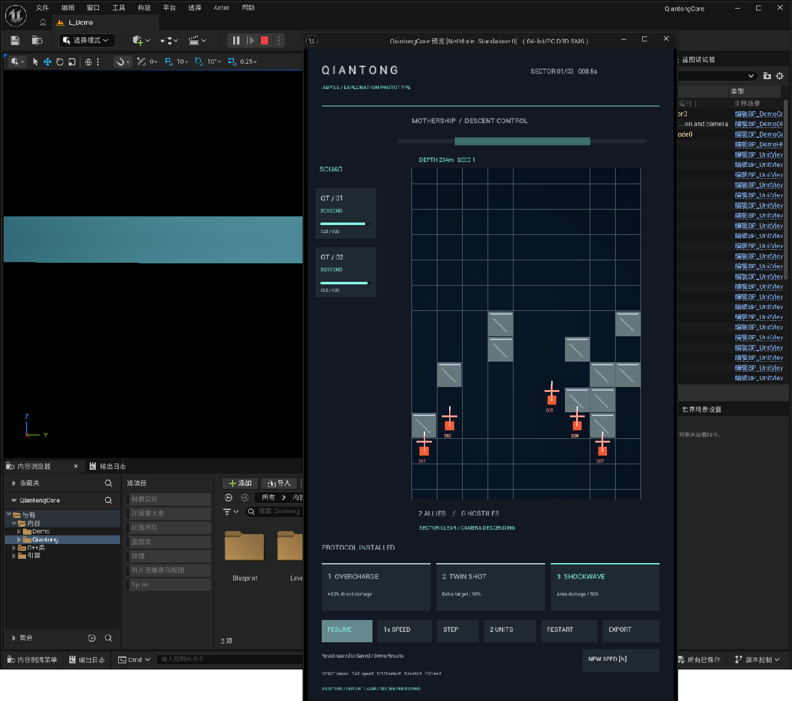

# 无尽深渊：千瞳 — UE5 原型

用于验证自动战斗、即时激光和连续竖井探索的 Unreal Engine 原型。当前版本为 **DEMO-03 / v3**：有限三波连续地图、随机障碍、自动避险、镜头先行与跨波次单位 Actor 保留。长期目标为 Cocos Creator 3.8.8 + TypeScript；迁移验证尚未执行。



## 获取与构建

```powershell
git clone https://github.com/NaimJeg/Qiantong.git
cd Qiantong

# 独立 Core：需要 Visual Studio 2022 C++ 工具链、Windows SDK、CMake 和 Python 3
powershell -NoProfile -ExecutionPolicy Bypass -File Tools/Build.ps1 -CoreOnly

# 项目：使用已编译的 UE 5.8.3 源码版，按实际安装位置替换路径
powershell -NoProfile -ExecutionPolicy Bypass -File Tools/Build.ps1 -EngineRoot 'D:/UE/Source/UnrealEngine-5.8.3-release'

# 显式选择引擎启动，避免依赖本机 EngineAssociation GUID
& 'D:/UE/Source/UnrealEngine-5.8.3-release/Engine/Binaries/Win64/UnrealEditor.exe' "$PWD/QiantongCore.uproject"
```

引擎及插件源码不随仓库分发。Editor 配置需要 `.uproject` 中列出的插件，包括 ModelContextProtocol、MCPClientToolset、Terminal、EditorToolset、PythonScriptPlugin 和 EditorScriptingUtilities；使用具备这些插件的引擎环境。运行时不依赖 MCP/Python。当前工程与 Target 名仍为 `QiantongCore`，保留已有引擎关联。

## 运行与验证

打开 `/Game/Demo/Maps/L_Demo` 并 Play，建议使用 720×1280 独立 PIE 窗口。默认两人，可切换五人；1/2/3 选择协议，Space 暂停，句点单步，Tab 倍速，R 重开，N 换种子。

```powershell
powershell -NoProfile -ExecutionPolicy Bypass -File Tools/TestDemo.ps1 -EngineRoot 'D:/UE/Source/UnrealEngine-5.8.3-release'
```

该入口运行五组 UE 自动化测试；Core 构建入口另运行两项 CTest。现有 DEMO-03 的 Editor/PIE、蓝图与 Golden 验收见 [交接说明](docs/exec/DEMO_HANDOFF.md) 和 [验收证据](docs/exec/evidence/continuous-acceptance.json)。构建产物、缓存、Saved 日志及 Windows 包不入库；历史本地 Windows 包仅为 v1。

## 工程入口

- [开发契约](AGENTS.md)、[当前规则](docs/spec/DEMO_RULES.md)、[架构](docs/ARCHITECTURE.md)
- [抽象边界](docs/spec/ABSTRACTION_BOUNDARIES.md)、[UE 到 Cocos 迁移计划](docs/plan/UE_TO_COCOS_MIGRATION.md)
- [任务与验收状态](docs/TASK_BOARD.md)、[变更记录](docs/exec/CHANGELOG.md)
- `Source/QiantongCore`：纯 C++ 库；`Source/QiantongUE`：UE 集中模拟与表现
- `Content/Demo`：演示地图、材质及纯数据蓝图；`Tests/Golden`：各版本结果样本

后续开发以现行任务板为准；已提交原型不代表旧 P0/P1 或 Cocos 迁移门全部完成。
